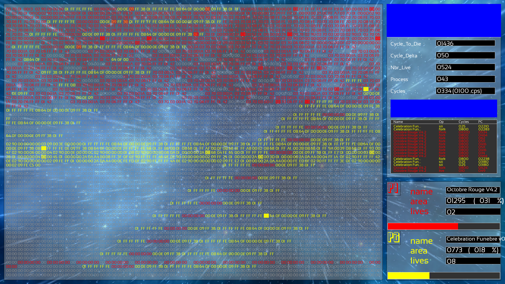

# Corewar

## Project description:
• Corewar is a very peculiar game. It’s about bringing “players” together around a
“virtual machine”, which will load some “champions” who will fight against one another with the support of “processes”, with the objective being for these champions
to stay “alive”.
• The processes are executed sequentially within the same virtual machine and memory space. They can therefore, among other things, write and rewrite on top of
each others so to corrupt one another, force the others to execute instructions that
can damage them, try to rewrite on the go the coding equivalent of a Côtes du
Rhône 1982 (that is one delicious French wine!), etc...
• The game ends when all the processes are dead. The winner is the last player
reported to be “alive”.

## Two distincitive parts:

### The assembler:
this is the program that will compile your champions and translate them from the language you will write them in (assembly language) into “Bytecode”.Bytecode is a machine code, which will be directly interpreted by the virtual
machine.
#### Usage
```make``` then ```./asm <file.s>```
If the <.s> file is valid, a <.cor> output will be created to be used for the corewar program

### The virtual machine:
It’s the “arena” in which your champions will be executed.
It offers various functions, all of which will be useful for the battle of the champions
#### Usage
```make``` then ```./corewar <file.cor>```

## A bonus: The visual:
#### Usage:
```bash sdl_linux.sh``` (if you are on linux) OR ```bash sdl_macos.sh``` (if you are on mac os)

then ```make corewar_visu``` and ```./corewar_visu <file.cor>```

touch escape to get out of the program. The keys + or - will help you accelerate or decrease the speed of the program. You can touch the "space" key to pause the game

### Example:
$> ./corewar_visu vm-champs-os/champs/Octobre_Rouge_V4.2.cor vm-champs-os/champs/Gagnant.cor


Obtained mark for this project : 125/100
